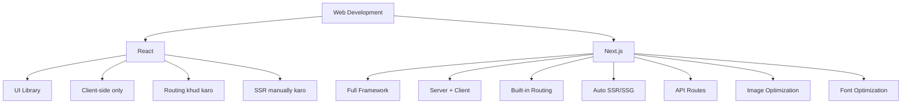
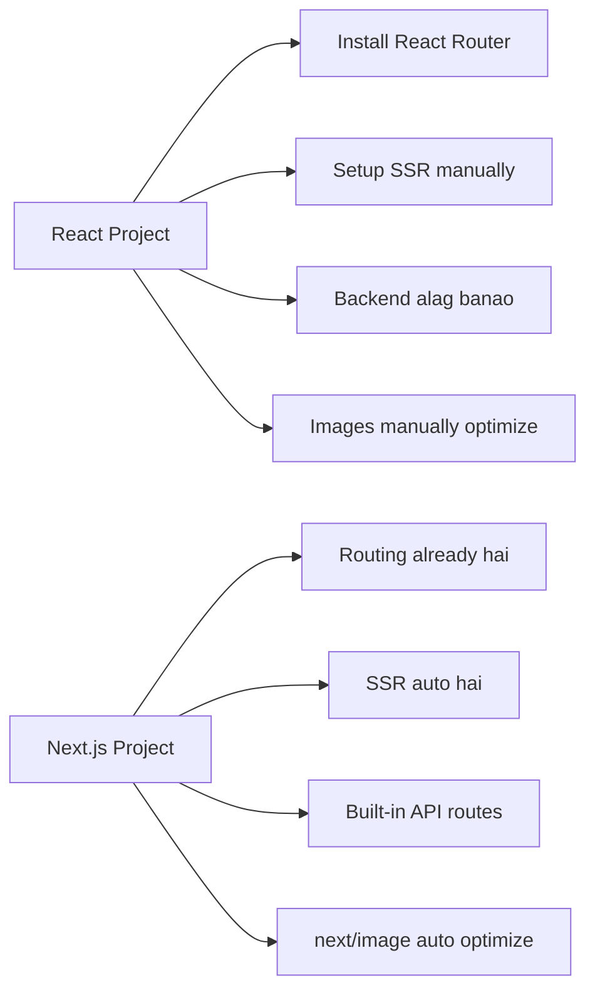
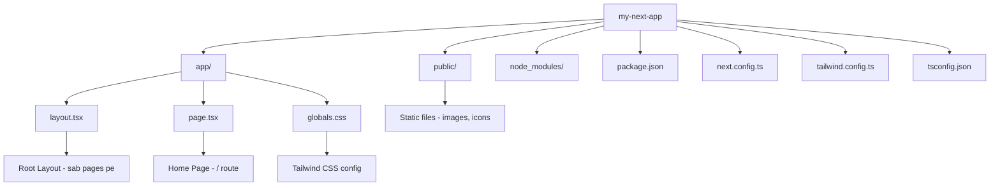
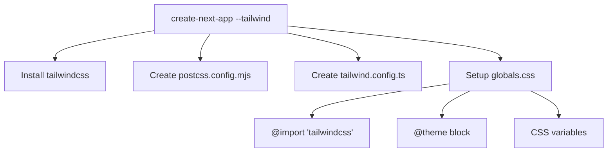

# Day 1: Next.js Introduction + Project Setup

## 📚 Aaj Kya Seekhoge?
- Next.js kya hai aur kyun use hota hai
- React vs Next.js difference
- create-next-app se project setup
- Project structure samajhna
- Development server start karna

---

## 🤔 Next.js Kya Hai?

Next.js ek **React framework** hai jo production-ready web applications banane ke liye use hota hai. Ye React ko leke aur powerful bata deta hai.



### Simple Words Mein:
- **React** = Sirf UI banane ka tool
- **Next.js** = React + Routing + SSR + API + Optimization = Complete Framework

---

## ⚔️ React vs Next.js

| Feature | React | Next.js |
|---------|-------|---------|
| Type | UI Library | Full Framework |
| Routing | React Router manually install karo | Built-in (file-based) |
| SSR | Manually setup karo | Auto support |
| API Routes | Alag backend chahiye | Built-in API routes |
| Image Optimization | Manual | next/image auto optimize |
| SEO | Difficult | Easy (server rendering) |
| Deployment | Complex | Easy (Vercel) |
| Learning Curve | Easy | Moderate |



---

## 🏭 Industry Usage

Next.js bohot si badi companies use karti hain:

```
✅ TikTok (Web Version)
✅ Twitch
✅ Netflix (Some parts)
✅ Hulu
✅ Nike
✅ GitHub (Some pages)
✅ Washington Post
✅ Vercel (Hosted on itself)
```

**Kyun use karti hain?**
1. **Performance** - Bohot fast hota hai
2. **SEO** - Search engines easily index kar sakte hain
3. **Developer Experience** - Easy to develop
4. **Scalability** - Millions of users handle kar sakta hai

---

## 🛠️ Project Setup

### Step 1: Node.js Install Karo

Pehle check karo Node.js installed hai ya nahi:

```bash
node --version
npm --version
```

Agar nahi hai to [nodejs.org](https://nodejs.org) se install karo (LTS version).

### Step 2: create-next-app Run Karo

```bash
npx create-next-app@latest my-next-app
```

### Step 3: Options Choose Karo

Terminal pe ye options aayenge - sab "Yes" kar do:

```
Would you like to use TypeScript? → Yes
Would you like to use ESLint? → Yes
Would you like to use Tailwind CSS? → Yes ✅ (Important!)
Would you like to use `src/` directory? → Yes
Would you like to use App Router? → Yes ✅ (Important!)
Would you like to customize the default import alias? → Yes
```

**⚠️ Important:** `Tailwind CSS` aur `App Router` MUST yes hona chahiye!

### Step 4: Project Folder Mein Jao

```bash
cd my-next-app
```

### Step 5: Development Server Start Karo

```bash
npm run dev
```

### Step 6: Browser Mein Khole

Browser mein jaao: **http://localhost:3000**

🎉 **Congratulations!** Tumhara Next.js project ready hai with Tailwind CSS!

---

## 📁 Project Structure Samjho



### Important Files:

| File | Kya karta hai |
|------|---------------|
| `app/page.tsx` | Home page (`/` route) |
| `app/layout.tsx` | Root layout (navbar, footer) |
| `app/globals.css` | Global styles + Tailwind config |
| `public/` | Images, icons, static files |
| `package.json` | Dependencies, scripts |
| `next.config.ts` | Next.js configuration |
| `tailwind.config.ts` | Tailwind configuration |
| `tsconfig.json` | TypeScript configuration |

---

## 🎨 Tailwind CSS Auto-Setup

Jab tum `create-next-app` mein "Yes" karte ho Tailwind ke liye, to ye automatically ho jata hai:



### globals.css automatically banta hai:

```css
@import "tailwindcss";

@theme {
  --color-background: var(--background);
  --color-foreground: var(--foreground);
  /* ... more variables */
}

:root {
  --background: #ffffff;
  --foreground: #171717;
}

@media (prefers-color-scheme: dark) {
  :root {
    --background: #0a0a0a;
    --foreground: #ededed;
  }
}
```

---

## 🏃 First Page Edit Karo

### Step 1: `app/page.tsx` kholo

```tsx
import Image from "next/image";

export default function Home() {
  return (
    <div className="grid grid-rows-[20px_1fr_20px] items-center justify-items-center min-h-screen p-8 pb-20 gap-16 sm:p-20 font-[family-name:var(--font-geist-sans)]">
      <main className="flex flex-col gap-8 row-start-2 items-center sm:items-start">
        <Image
          className="dark:invert"
          src="/next.svg"
          alt="Next.js logo"
          width={180}
          height={38}
          priority
        />
        <ol className="list-inside list-decimal text-sm text-center sm:text-left font-[family-name:var(--font-geist-mono)]">
          <li className="mb-2">
            Get started by editing{" "}
            <code className="bg-black/[.05] dark:bg-white/[.06] px-1 py-0.5 rounded font-semibold">
              app/page.tsx
            </code>
            .
          </li>
          <li>Save and see your changes instantly.</li>
        </ol>
      </main>
    </div>
  );
}
```

### Step 2: Simple Content Likho

```tsx
export default function Home() {
  return (
    <div className="min-h-screen bg-gray-100 flex items-center justify-center">
      <div className="text-center">
        <h1 className="text-4xl font-bold text-blue-600 mb-4">
          Hello Next.js! 🚀
        </h1>
        <p className="text-xl text-gray-600">
          Mera pehla Next.js page with Tailwind CSS
        </p>
      </div>
    </div>
  );
}
```

### Step 3: Browser Mein Dekho

Browser mein jaao **http://localhost:3000** aur dekho - page automatically update ho gaya! 🎉

---

## 📦 Scripts Samjho

`package.json` mein ye scripts hoti hain:

```json
{
  "scripts": {
    "dev": "next dev --turbopack",
    "build": "next build",
    "start": "next start",
    "lint": "next lint"
  }
}
```

| Script | Kya karta hai | Kab use karo |
|--------|---------------|--------------|
| `npm run dev` | Development server start | Development ke waqt |
| `npm run build` | Production build banao | Deploy se pehle |
| `npm run start` | Production server start | Build ke baad |
| `npm run lint` | Code check karo | Code quality ke liye |

---

## 🎯 Aaj Ka Summary

| Concept | Kya Seekha |
|---------|------------|
| Next.js | React ka framework with routing, SSR, API |
| React vs Next.js | Next.js mein sab built-in hai |
| create-next-app | Project setup command |
| Project Structure | app/, public/, config files |
| Tailwind Auto-setup | create-next-app mein auto-install |
| Development Server | npm run dev |

---

## 🔗 Useful Resources
- [Next.js Docs](https://nextjs.org/docs)
- [Next.js Learn Course](https://nextjs.org/learn)
- [Tailwind CSS Docs](https://tailwindcss.com)
- [create-next-app Docs](https://nextjs.org/docs/app/api-reference/cli/create-next-app)

---

## ✅ Next Steps
- Kal hum **App Router Basics** seekhenge
- Aaj ke practice problems solve karo
