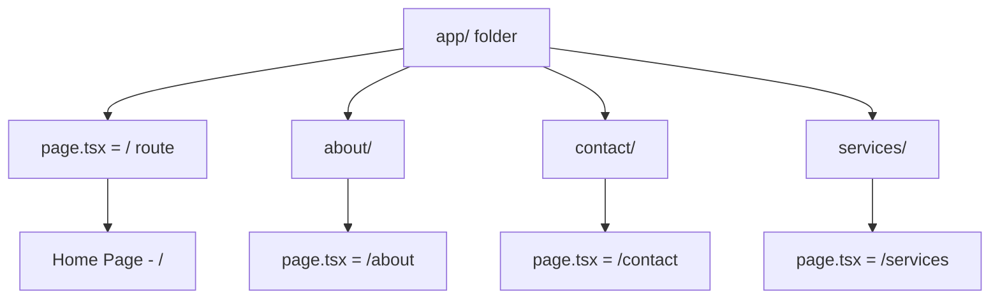
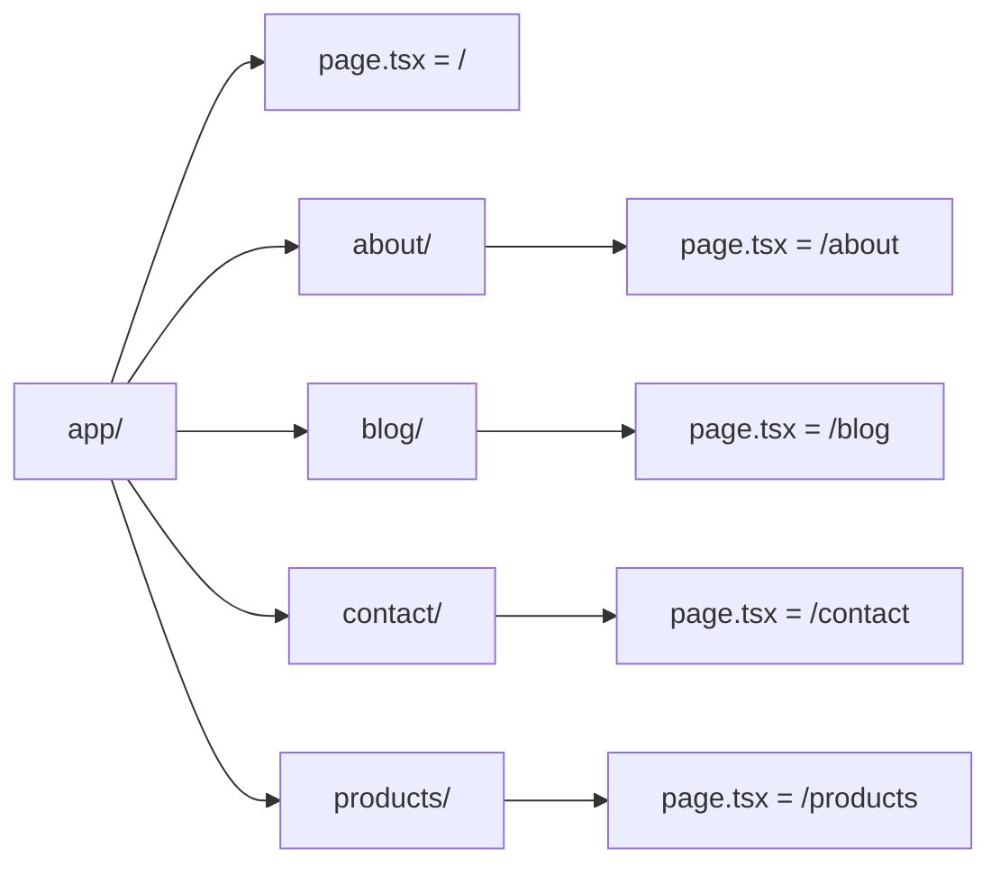

# Day 2: App Router Basics

## 📚 Aaj Kya Seekhoge?
- File-based routing samajhna
- page.tsx se route banana
- Multiple pages banana
- Navigation between pages

---

## 🤔 App Router Kya Hai?

App Router Next.js ka **routing system** hai jo file system pe based hai. Matlab: **Folder = Route**



### Simple Rule:
```
app/page.tsx        →  /
app/about/page.tsx  →  /about
app/contact/page.tsx →  /contact
```

---

## 📁 Routing Examples



### Folder Structure:
```
app/
├── page.tsx              → /
├── about/
│   └── page.tsx          → /about
├── contact/
│   └── page.tsx          → /contact
├── services/
│   └── page.tsx          → /services
└── blog/
    └── page.tsx          → /blog
```

---

## 🛠️ Routes Kaise Banti Hain?

### Step 1: Folder Banao
`app/` folder ke andar naya folder banao:

```bash
# Terminal mein
mkdir app/about
mkdir app/contact
mkdir app/services
```

### Step 2: page.tsx Banao
Har folder mein `page.tsx` file banao:

```bash
# Terminal mein
touch app/about/page.tsx
touch app/contact/page.tsx
touch app/services/page.tsx
```

### Step 3: Content Likho
Har `page.tsx` mein content likho:

```tsx
// app/about/page.tsx
export default function AboutPage() {
  return (
    <div className="min-h-screen bg-gray-100 p-8">
      <h1 className="text-4xl font-bold text-blue-600">About Us</h1>
      <p className="text-lg mt-4">Ye hamara about page hai.</p>
    </div>
  );
}
```

---

## 🎯 Page Component Kaise Likhte Hain?

### Basic Page Structure:
```tsx
export default function PageName() {
  return (
    <div>
      {/* Content yahan */}
    </div>
  );
}
```

### Important Rules:
1. **Export default** hona chahiye
2. **Function name** PascalCase mein hona chahiye
3. **Return** mein JSX hona chahiye

### Examples:

```tsx
// Home Page
export default function Home() {
  return <div>Home Page</div>;
}

// About Page
export default function About() {
  return <div>About Page</div>;
}

// Contact Page
export default function Contact() {
  return <div>Contact Page</div>;
}
```

---

## 🔗 Navigation Kaise Karte Hain?

### Method 1: Link Component (Recommended)

```tsx
import Link from "next/link";

export default function Home() {
  return (
    <div>
      <h1>Home Page</h1>
      
      {/* Link se navigation */}
      <Link href="/about" className="text-blue-500 hover:underline">
        About Page pe jao
      </Link>
      
      <Link href="/contact" className="text-blue-500 hover:underline">
        Contact Page pe jao
      </Link>
    </div>
  );
}
```

### Method 2: useRouter Hook (Programmatic)

```tsx
"use client"; // Client component hona chahiye

import { useRouter } from "next/navigation";

export default function Home() {
  const router = useRouter();
  
  return (
    <div>
      <h1>Home Page</h1>
      
      <button 
        onClick={() => router.push("/about")}
        className="bg-blue-500 text-white px-4 py-2 rounded"
      >
        About Page pe jao
      </button>
    </div>
  );
}
```

---

## 📝 Complete Example

### app/page.tsx (Home):
```tsx
import Link from "next/link";

export default function Home() {
  return (
    <div className="min-h-screen bg-gray-100">
      {/* Navigation */}
      <nav className="bg-white shadow-md p-4">
        <div className="max-w-6xl mx-auto flex justify-between items-center">
          <div className="text-xl font-bold text-blue-600">MySite</div>
          <div className="flex gap-6">
            <Link href="/" className="text-gray-800 hover:text-blue-600">
              Home
            </Link>
            <Link href="/about" className="text-gray-800 hover:text-blue-600">
              About
            </Link>
            <Link href="/contact" className="text-gray-800 hover:text-blue-600">
              Contact
            </Link>
            <Link href="/services" className="text-gray-800 hover:text-blue-600">
              Services
            </Link>
          </div>
        </div>
      </nav>

      {/* Hero Section */}
      <div className="max-w-6xl mx-auto p-8">
        <div className="text-center py-20">
          <h1 className="text-6xl font-bold text-gray-800 mb-4">
            Welcome to MySite
          </h1>
          <p className="text-xl text-gray-600 mb-8">
            Ye mera pehla Next.js website hai with Tailwind CSS
          </p>
          <Link 
            href="/about" 
            className="bg-blue-500 text-white px-8 py-3 rounded-lg text-lg hover:bg-blue-600"
          >
            About Us
          </Link>
        </div>
      </div>
    </div>
  );
}
```

### app/about/page.tsx:
```tsx
import Link from "next/link";

export default function About() {
  return (
    <div className="min-h-screen bg-gray-100">
      {/* Navigation */}
      <nav className="bg-white shadow-md p-4">
        <div className="max-w-6xl mx-auto flex justify-between items-center">
          <div className="text-xl font-bold text-blue-600">MySite</div>
          <div className="flex gap-6">
            <Link href="/" className="text-gray-800 hover:text-blue-600">
              Home
            </Link>
            <Link href="/about" className="text-blue-600 font-semibold">
              About
            </Link>
            <Link href="/contact" className="text-gray-800 hover:text-blue-600">
              Contact
            </Link>
          </div>
        </div>
      </nav>

      {/* Content */}
      <div className="max-w-6xl mx-auto p-8">
        <h1 className="text-4xl font-bold text-gray-800 mb-4">About Us</h1>
        <p className="text-lg text-gray-600 mb-4">
          Hum ek team hain jo websites banati hai.
        </p>
        <Link href="/" className="text-blue-500 hover:underline">
          ← Back to Home
        </Link>
      </div>
    </div>
  );
}
```

---

## 🎯 Aaj Ka Summary

| Concept | Kya Seekha |
|---------|------------|
| File-based Routing | Folder = Route |
| page.tsx | Ye file route banati hai |
| Link Component | Client-side navigation |
| useRouter | Programmatic navigation |
| Export Default | Har page mein chahiye |

---

## 🔗 Useful Resources
- [App Router Docs](https://nextjs.org/docs/app/building-your-application/routing)
- [Link Component](https://nextjs.org/docs/app/api-reference/components/link)
- [useRouter Hook](https://nextjs.org/docs/app/api-reference/functions/use-router)

---

## ✅ Next Steps
- Kal hum **Layouts & Navigation** seekhenge
- Navbar aur Footer banana seekhenge
- Aaj ke practice problems solve karo
