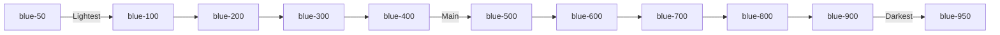
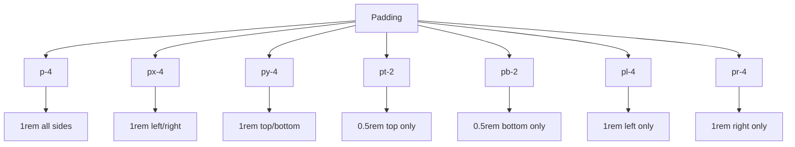
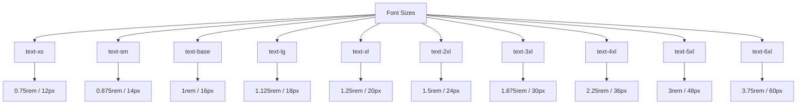

# Day 3: Tailwind CSS Fundamentals

## 📚 Aaj Kya Seekhoge?
- Tailwind CSS utility classes detail mein
- Colors, Padding, Margin
- Font sizes aur weights
- Background colors
- Borders aur shadows
- Hover effects

---

## 🤔 Tailwind CSS Kya Hai?

Tailwind CSS ek **utility-first CSS framework** hai. Iska matlab hai ki tum ready-made CSS classes directly HTML/JSX mein use karte ho.

```mermaid
graph TD
    A[Traditional CSS] --> B[style.css file]
    A --> C[.my-class { padding: 1rem; }]
    A --> D[Galti se class change ho jaye to toot jaye]
    
    E[Tailwind CSS] --> F[No separate file]
    E --> G[class="p-4"]
    E --> H[Ready-made classes]
    E --> I[Consistent design]
```

---

## 🎨 Color System

Tailwind mein colors ka system bohot organized hai:



### Text Colors:
```tsx
<p className="text-blue-500">Blue text</p>
<p className="text-red-600">Red text</p>
<p className="text-green-700">Green text</p>
<p className="text-gray-800">Dark gray text</p>
<p className="text-yellow-500">Yellow text</p>
```

### Background Colors:
```tsx
<div className="bg-blue-500">Blue background</div>
<div className="bg-red-100">Light red background</div>
<div className="bg-green-200">Lighter green background</div>
<div className="bg-gray-900">Dark background</div>
```

### Color Combinations:
```tsx
<div className="bg-blue-500 text-white">Blue bg, white text</div>
<div className="bg-white text-gray-800">White bg, dark text</div>
<div className="bg-yellow-400 text-black">Yellow bg, black text</div>
```

---

## 📏 Padding (Spacing Inside)

Padding ka matlab hai andar ka space:



### Visual Guide:
```
┌─────────────────────────────┐
│           pt-2              │
│    ┌───────────────────┐    │
│    │                   │    │
│pl4 │     Content       │ pr4│
│    │                   │    │
│    └───────────────────┘    │
│           pb-2              │
└─────────────────────────────┘
```

### Examples:
```tsx
<div className="p-4">Padding 1rem all sides</div>
<div className="px-6">Padding 1.5rem left/right</div>
<div className="py-8">Padding 2rem top/bottom</div>
<div className="pt-2 pb-4 pl-6 pr-8">Individual padding</div>
```

### Padding Sizes:
| Class | Size | Pixels (approx) |
|-------|------|-----------------|
| `p-1` | 0.25rem | 4px |
| `p-2` | 0.5rem | 8px |
| `p-3` | 0.75rem | 12px |
| `p-4` | 1rem | 16px |
| `p-5` | 1.25rem | 20px |
| `p-6` | 1.5rem | 24px |
| `p-8` | 2rem | 32px |

---

## 📏 Margin (Spacing Outside)

Margin ka matlab hai bahar ka space:

```tsx
<div className="m-4">Margin 1rem all sides</div>
<div className="mx-auto">Center horizontally</div>
<div className="mt-8">Margin top 2rem</div>
<div className="mb-4">Margin bottom 1rem</div>
<div className="ml-auto">Push to right</div>
```

### Margin Sizes:
| Class | Size | Pixels (approx) |
|-------|------|-----------------|
| `m-1` | 0.25rem | 4px |
| `m-2` | 0.5rem | 8px |
| `m-3` | 0.75rem | 12px |
| `m-4` | 1rem | 16px |
| `m-6` | 1.5rem | 24px |
| `m-8` | 2rem | 32px |

---

## 🔤 Font Sizes



### Examples:
```tsx
<p className="text-xs">Extra small text (12px)</p>
<p className="text-sm">Small text (14px)</p>
<p className="text-base">Normal text (16px)</p>
<p className="text-lg">Large text (18px)</p>
<p className="text-xl">Extra large (20px)</p>
<p className="text-2xl">2X large (24px)</p>
<p className="text-3xl">3X large (30px)</p>
<p className="text-4xl">4X large (36px)</p>
<p className="text-5xl">5X large (48px)</p>
```

---

## 💪 Font Weights

```tsx
<p className="font-thin">Thin (100)</p>
<p className="font-light">Light (300)</p>
<p className="font-normal">Normal (400)</p>
<p className="font-medium">Medium (500)</p>
<p className="font-semibold">Semibold (600)</p>
<p className="font-bold">Bold (700)</p>
<p className="font-extrabold">Extra Bold (800)</p>
<p className="font-black">Black (900)</p>
```

---

## 🎯 Text Alignment

```tsx
<p className="text-left">Left aligned</p>
<p className="text-center">Center aligned</p>
<p className="text-right">Right aligned</p>
<p className="text-justify">Justified text</p>
```

---

## 🖼️ Borders

```tsx
<div className="border">1px border all sides</div>
<div className="border-2">2px border</div>
<div className="border-4">4px border</div>
<div className="border border-gray-300">Gray border</div>
<div className="border border-blue-500">Blue border</div>
<div className="border-t border-b">Top and bottom border only</div>
```

### Border Radius:
```tsx
<div className="rounded">Small radius</div>
<div className="rounded-md">Medium radius</div>
<div className="rounded-lg">Large radius</div>
<div className="rounded-xl">Extra large radius</div>
<div className="rounded-2xl">2X large radius</div>
<div className="rounded-full">Circle/Pill shape</div>
```

---

## 🌟 Shadows

```tsx
<div className="shadow-sm">Small shadow</div>
<div className="shadow">Default shadow</div>
<div className="shadow-md">Medium shadow</div>
<div className="shadow-lg">Large shadow</div>
<div className="shadow-xl">Extra large shadow</div>
<div className="shadow-2xl">2X large shadow</div>
```

---

## ✨ Hover Effects

```tsx
<button className="bg-blue-500 hover:bg-blue-600 text-white px-4 py-2 rounded">
  Hover me dark hoga
</button>

<button className="bg-green-500 hover:bg-green-700 text-white px-4 py-2 rounded">
  Hover me aur dark
</button>

<div className="bg-white hover:shadow-lg p-4 rounded transition-shadow">
  Card with hover shadow
</div>
```

---

## 📝 Complete Example

```tsx
export default function Home() {
  return (
    <div className="min-h-screen bg-gray-100 p-8">
      <h1 className="text-4xl font-bold text-gray-800 mb-4 text-center">
        Tailwind CSS Fundamentals
      </h1>
      
      <div className="max-w-4xl mx-auto space-y-8">
        
        {/* Color Example */}
        <div className="bg-white p-6 rounded-lg shadow-md">
          <h2 className="text-2xl font-bold mb-4 text-blue-600">Colors</h2>
          <div className="flex gap-4">
            <div className="bg-red-500 text-white p-4 rounded">Red</div>
            <div className="bg-blue-500 text-white p-4 rounded">Blue</div>
            <div className="bg-green-500 text-white p-4 rounded">Green</div>
            <div className="bg-yellow-400 text-black p-4 rounded">Yellow</div>
          </div>
        </div>
        
        {/* Padding Example */}
        <div className="bg-white p-6 rounded-lg shadow-md">
          <h2 className="text-2xl font-bold mb-4 text-green-600">Padding</h2>
          <div className="flex gap-4">
            <div className="bg-blue-200 p-2">p-2</div>
            <div className="bg-blue-300 p-4">p-4</div>
            <div className="bg-blue-400 p-6">p-6</div>
            <div className="bg-blue-500 p-8">p-8</div>
          </div>
        </div>
        
        {/* Font Sizes Example */}
        <div className="bg-white p-6 rounded-lg shadow-md">
          <h2 className="text-2xl font-bold mb-4 text-purple-600">Font Sizes</h2>
          <p className="text-xs mb-2">text-xs - Extra small</p>
          <p className="text-sm mb-2">text-sm - Small</p>
          <p className="text-base mb-2">text-base - Normal</p>
          <p className="text-lg mb-2">text-lg - Large</p>
          <p className="text-xl mb-2">text-xl - Extra large</p>
          <p className="text-2xl mb-2">text-2xl - 2X large</p>
          <p className="text-3xl mb-2">text-3xl - 3X large</p>
        </div>
        
        {/* Border & Shadow Example */}
        <div className="bg-white p-6 rounded-lg shadow-md">
          <h2 className="text-2xl font-bold mb-4 text-red-600">Borders & Shadows</h2>
          <div className="flex gap-4">
            <div className="border border-gray-300 p-4 rounded">Border</div>
            <div className="border-2 border-blue-500 p-4 rounded">2px Border</div>
            <div className="shadow-lg p-4 rounded">Shadow</div>
            <div className="border-2 border-green-500 shadow-xl p-4 rounded">Both</div>
          </div>
        </div>
        
        {/* Button Examples */}
        <div className="bg-white p-6 rounded-lg shadow-md">
          <h2 className="text-2xl font-bold mb-4 text-yellow-600">Buttons with Hover</h2>
          <div className="flex gap-4">
            <button className="bg-blue-500 hover:bg-blue-700 text-white px-6 py-2 rounded font-medium transition-colors">
              Blue Button
            </button>
            <button className="bg-green-500 hover:bg-green-700 text-white px-6 py-2 rounded font-medium transition-colors">
              Green Button
            </button>
            <button className="bg-red-500 hover:bg-red-700 text-white px-6 py-2 rounded font-medium transition-colors">
              Red Button
            </button>
          </div>
        </div>
        
      </div>
    </div>
  );
}
```

---

## 🎯 Aaj Ka Summary

| Category | Classes | Use Case |
|----------|---------|----------|
| Text Color | `text-blue-500` | Text ka rang |
| Background | `bg-red-200` | Background rang |
| Padding | `p-4`, `px-6`, `py-2` | Andar ka space |
| Margin | `m-4`, `mx-auto` | Bahar ka space |
| Font Size | `text-xl`, `text-2xl` | Text bada/chhota |
| Font Weight | `font-bold`, `font-medium` | Text mota/patla |
| Border | `border`, `border-2` | Border add karo |
| Rounded | `rounded-lg` | Corners gol karo |
| Shadow | `shadow-md` | Shadow add karo |
| Hover | `hover:bg-blue-600` | Hover pe change |

---

## ✅ Next Steps
- Kal hum **Flexbox & Grid** seekhenge
- Layouts banana seekhenge
- Aaj ke practice problems solve karo
