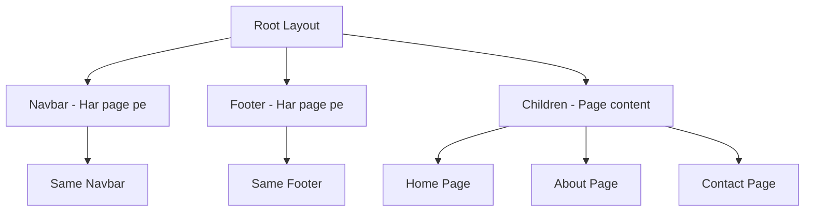

# Day 4: Layouts & Navigation

## 📚 Aaj Kya Seekhoge?
- Root layout samajhna
- Nested layouts banana
- Navbar aur Footer components
- Reuseable layouts
- Navigation patterns

---

## 🤔 Layout Kya Hai?

Layout ek **shared UI** hai jo multiple pages pe dikhta hai. Jaise Navbar aur Footer har page pe hote hain.



---

## 📁 Layout Structure

```mermaid
graph TD
    A[app/layout.tsx] --> B[<html>]
    B --> C[<body>]
    C --> D[Navbar Component]
    C --> E[{children} - Page Content]
    C --> F[Footer Component]
```

### Root Layout File: `app/layout.tsx`

```tsx
import type { Metadata } from "next";
import { Inter } from "next/font/google";
import "./globals.css";
import Navbar from "./components/Navbar";
import Footer from "./components/Footer";

const inter = Inter({ subsets: ["latin"] });

export const metadata: Metadata = {
  title: "My Next.js App",
  description: "Learning Next.js with Tailwind CSS",
};

export default function RootLayout({
  children,
}: {
  children: React.ReactNode;
}) {
  return (
    <html lang="en">
      <body className={inter.className}>
        <Navbar />
        <main>{children}</main>
        <Footer />
      </body>
    </html>
  );
}
```

---

## 🧭 Navbar Component

### Simple Navbar:
```tsx
// app/components/Navbar.tsx
import Link from "next/link";

export default function Navbar() {
  return (
    <nav className="bg-gray-800 text-white">
      <div className="max-w-6xl mx-auto px-4 py-4">
        <div className="flex justify-between items-center">
          {/* Logo */}
          <Link href="/" className="text-xl font-bold">
            MySite
          </Link>
          
          {/* Navigation Links */}
          <div className="flex gap-6">
            <Link href="/" className="hover:text-gray-300">
              Home
            </Link>
            <Link href="/about" className="hover:text-gray-300">
              About
            </Link>
            <Link href="/services" className="hover:text-gray-300">
              Services
            </Link>
            <Link href="/contact" className="hover:text-gray-300">
              Contact
            </Link>
          </div>
        </div>
      </div>
    </nav>
  );
}
```

### Active Link Pattern:
```tsx
"use client";

import Link from "next/link";
import { usePathname } from "next/navigation";

export default function Navbar() {
  const pathname = usePathname();
  
  const links = [
    { href: "/", label: "Home" },
    { href: "/about", label: "About" },
    { href: "/services", label: "Services" },
    { href: "/contact", label: "Contact" },
  ];
  
  return (
    <nav className="bg-gray-800 text-white">
      <div className="max-w-6xl mx-auto px-4 py-4">
        <div className="flex justify-between items-center">
          <Link href="/" className="text-xl font-bold">
            MySite
          </Link>
          
          <div className="flex gap-6">
            {links.map((link) => (
              <Link
                key={link.href}
                href={link.href}
                className={`hover:text-gray-300 ${
                  pathname === link.href ? "text-blue-400 font-semibold" : ""
                }`}
              >
                {link.label}
              </Link>
            ))}
          </div>
        </div>
      </div>
    </nav>
  );
}
```

---

## 🦶 Footer Component

```tsx
// app/components/Footer.tsx
import Link from "next/link";

export default function Footer() {
  return (
    <footer className="bg-gray-900 text-white">
      <div className="max-w-6xl mx-auto px-4 py-8">
        <div className="grid grid-cols-1 md:grid-cols-3 gap-8">
          {/* About */}
          <div>
            <h3 className="text-xl font-bold mb-4">About</h3>
            <p className="text-gray-400">
              Hum Next.js seekh rahe hain aur websites bana rahe hain.
            </p>
          </div>
          
          {/* Links */}
          <div>
            <h3 className="text-xl font-bold mb-4">Quick Links</h3>
            <ul className="space-y-2 text-gray-400">
              <li><Link href="/" className="hover:text-white">Home</Link></li>
              <li><Link href="/about" className="hover:text-white">About</Link></li>
              <li><Link href="/contact" className="hover:text-white">Contact</Link></li>
            </ul>
          </div>
          
          {/* Contact */}
          <div>
            <h3 className="text-xl font-bold mb-4">Contact</h3>
            <p className="text-gray-400">Email: info@mysite.com</p>
            <p className="text-gray-400">Phone: +92 300 1234567</p>
          </div>
        </div>
        
        {/* Copyright */}
        <div className="border-t border-gray-800 mt-8 pt-8 text-center text-gray-400">
          <p>&copy; 2026 MySite. All rights reserved.</p>
        </div>
      </div>
    </footer>
  );
}
```

---

## 📝 Complete Example

### app/layout.tsx:
```tsx
import type { Metadata } from "next";
import { Inter } from "next/font/google";
import "./globals.css";
import Navbar from "./components/Navbar";
import Footer from "./components/Footer";

const inter = Inter({ subsets: ["latin"] });

export const metadata: Metadata = {
  title: "My Next.js App",
  description: "Learning Next.js with Tailwind CSS",
};

export default function RootLayout({
  children,
}: {
  children: React.ReactNode;
}) {
  return (
    <html lang="en">
      <body className={inter.className}>
        <div className="min-h-screen flex flex-col">
          <Navbar />
          <main className="flex-1">{children}</main>
          <Footer />
        </div>
      </body>
    </html>
  );
}
```

### app/page.tsx (Home):
```tsx
import Link from "next/link";

export default function Home() {
  return (
    <div>
      {/* Hero Section */}
      <div className="bg-gradient-to-r from-blue-500 to-purple-600 text-white py-20">
        <div className="max-w-6xl mx-auto px-4 text-center">
          <h1 className="text-5xl font-bold mb-4">Welcome to MySite</h1>
          <p className="text-xl mb-8">Next.js aur Tailwind CSS seekh rahe hain</p>
          <Link 
            href="/about" 
            className="bg-white text-blue-500 px-8 py-3 rounded-lg font-bold hover:bg-gray-100"
          >
            About Us
          </Link>
        </div>
      </div>
      
      {/* Features Section */}
      <div className="max-w-6xl mx-auto px-4 py-16">
        <h2 className="text-3xl font-bold text-center mb-12">Our Features</h2>
        <div className="grid grid-cols-1 md:grid-cols-3 gap-8">
          <div className="text-center p-6">
            <div className="text-5xl mb-4">🚀</div>
            <h3 className="text-xl font-bold mb-2">Fast</h3>
            <p className="text-gray-600">Lightning fast performance</p>
          </div>
          <div className="text-center p-6">
            <div className="text-5xl mb-4">🔒</div>
            <h3 className="text-xl font-bold mb-2">Secure</h3>
            <p className="text-gray-600">Enterprise level security</p>
          </div>
          <div className="text-center p-6">
            <div className="text-5xl mb-4">📱</div>
            <h3 className="text-xl font-bold mb-2">Responsive</h3>
            <p className="text-gray-600">Works on all devices</p>
          </div>
        </div>
      </div>
    </div>
  );
}
```

---

## 🎯 Aaj Ka Summary

| Concept | Kya Seekha |
|---------|------------|
| Root Layout | Har page pe dikhta hai |
| {children} | Page content yahan aata hai |
| Navbar | Reuseable navigation component |
| Footer | Reuseable footer component |
| Active Link | usePathname se current path pata |

---

## ✅ Next Steps
- Kal hum **Dynamic Routes** seekhenge
- [slug] pattern seekhenge
- Blog posts banana seekhenge
- Aaj ke practice problems solve karo
