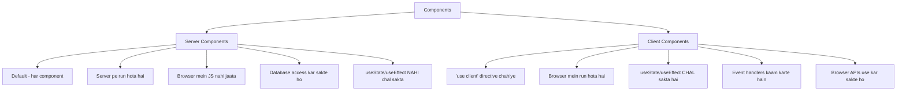
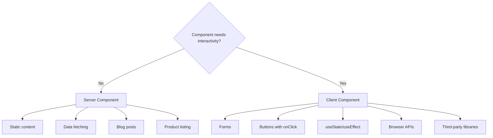

# Day 6: Server vs Client Components

## 📚 Aaj Kya Seekhoge?
- Server Components kya hain
- Client Components kya hain
- 'use client' directive
- Kab kaunsa use kare
- Common patterns

---

## 🤔 Server vs Client Components



---

## 🖥️ Server Components (Default)

Server Components **server pe run** hote hain aur browser mein **koi JavaScript nahi** bhejte.

### Benefits:
1. **Zero JavaScript** - Browser mein JS bundle chhota
2. **Direct Database Access** - Database se seedha data fetch
3. **Better Performance** - Server pe sab kuch hota hai
4. **Security** - Secrets server pe safe hain

### Example:
```tsx
// app/page.tsx (Server Component by default)
export default async function Home() {
  // Direct database fetch kar sakte ho
  const data = await fetch('https://api.example.com/users');
  const users = await data.json();
  
  return (
    <div>
      <h1>Users List</h1>
      {users.map(user => (
        <div key={user.id}>{user.name}</div>
      ))}
    </div>
  );
}
```

### Server Component mein Kya NAHI kar sakte:
```tsx
// ❌ GALAT - Server Component mein useState nahi chalta
export default function Button() {
  const [count, setCount] = useState(0); // ERROR!
  return <button onClick={() => setCount(count + 1)}>{count}</button>;
}

// ❌ GALAT - Event handlers nahi chalte
export default function Button() {
  return <button onClick={() => alert('clicked!')}>Click</button>;
}

// ❌ GALAT - useEffect nahi chalta
export default function Component() {
  useEffect(() => { // ERROR!
    console.log('mounted');
  }, []);
  return <div>Hello</div>;
}
```

---

## 🌐 Client Components

Client Components **browser mein run** hote hain. Inke liye `'use client'` directive zaroori hai.

### 'use client' Directive:
```tsx
"use client"; // Ye file ki SHURUAT mein hona chahiye

import { useState } from "react";

export default function Counter() {
  const [count, setCount] = useState(0);
  
  return (
    <button onClick={() => setCount(count + 1)}>
      Count: {count}
    </button>
  );
}
```

### Client Component mein Kya kar sakte ho:
```tsx
"use client";

import { useState, useEffect } from "react";

export default function InteractiveComponent() {
  const [count, setCount] = useState(0);
  const [data, setData] = useState(null);
  
  useEffect(() => {
    console.log('Component mounted');
  }, []);
  
  const handleClick = () => {
    alert('Button clicked!');
    setCount(count + 1);
  };
  
  return (
    <div>
      <p>Count: {count}</p>
      <button onClick={handleClick}>Click Me</button>
    </div>
  );
}
```

---

## 🤔 Kab Kaunsa Use Kare?



### Decision Table:

| Scenario | Component Type | Reason |
|----------|---------------|--------|
| Displaying static content | Server | No interactivity needed |
| Fetching data from DB/API | Server | Direct server access |
| Blog post content | Server | Static display |
| Product listing | Server | Data fetching |
| Forms with inputs | Client | User interaction |
| Button with onClick | Client | Event handler |
| useState/useEffect | Client | Hooks need browser |
| Modal/Dialog | Client | Interactive UI |
| Dark mode toggle | Client | useState needed |
| Search with filtering | Client | useState + onChange |

---

## 📝 Complete Example

### Server Component (page):
```tsx
// app/page.tsx (Server Component)
import ClientCounter from "./components/ClientCounter";
import ClientForm from "./components/ClientForm";

export default function Home() {
  // Server Component - data fetch directly
  const posts = [
    { id: 1, title: "Post 1", content: "Content 1" },
    { id: 2, title: "Post 2", content: "Content 2" },
    { id: 3, title: "Post 3", content: "Content 3" },
  ];
  
  return (
    <div className="max-w-4xl mx-auto p-8">
      <h1 className="text-4xl font-bold mb-8">Server vs Client Components</h1>
      
      {/* Server-rendered content */}
      <section className="mb-8">
        <h2 className="text-2xl font-bold mb-4">Posts (Server Component)</h2>
        <div className="space-y-4">
          {posts.map(post => (
            <div key={post.id} className="bg-white p-4 rounded shadow">
              <h3 className="font-bold">{post.title}</h3>
              <p className="text-gray-600">{post.content}</p>
            </div>
          ))}
        </div>
      </section>
      
      {/* Client Components */}
      <section className="mb-8">
        <h2 className="text-2xl font-bold mb-4">Interactive Elements</h2>
        <ClientCounter />
        <ClientForm />
      </section>
    </div>
  );
}
```

### Client Component (Counter):
```tsx
// app/components/ClientCounter.tsx
"use client";

import { useState } from "react";

export default function ClientCounter() {
  const [count, setCount] = useState(0);
  
  return (
    <div className="bg-white p-4 rounded shadow mb-4">
      <h3 className="font-bold mb-2">Client Counter</h3>
      <p className="text-2xl mb-4">Count: {count}</p>
      <div className="flex gap-2">
        <button 
          onClick={() => setCount(count - 1)}
          className="bg-red-500 text-white px-4 py-2 rounded"
        >
          -1
        </button>
        <button 
          onClick={() => setCount(count + 1)}
          className="bg-green-500 text-white px-4 py-2 rounded"
        >
          +1
        </button>
      </div>
    </div>
  );
}
```

### Client Component (Form):
```tsx
// app/components/ClientForm.tsx
"use client";

import { useState } from "react";

export default function ClientForm() {
  const [name, setName] = useState("");
  const [email, setEmail] = useState("");
  const [submitted, setSubmitted] = useState(false);
  
  const handleSubmit = (e: React.FormEvent) => {
    e.preventDefault();
    console.log({ name, email });
    setSubmitted(true);
  };
  
  return (
    <div className="bg-white p-4 rounded shadow">
      <h3 className="font-bold mb-2">Client Form</h3>
      
      {submitted ? (
        <div className="bg-green-100 text-green-800 p-4 rounded">
          Form submitted! Name: {name}, Email: {email}
        </div>
      ) : (
        <form onSubmit={handleSubmit} className="space-y-4">
          <input
            type="text"
            placeholder="Name"
            value={name}
            onChange={(e) => setName(e.target.value)}
            className="w-full px-3 py-2 border rounded"
          />
          <input
            type="email"
            placeholder="Email"
            value={email}
            onChange={(e) => setEmail(e.target.value)}
            className="w-full px-3 py-2 border rounded"
          />
          <button 
            type="submit"
            className="bg-blue-500 text-white px-4 py-2 rounded"
          >
            Submit
          </button>
        </form>
      )}
    </div>
  );
}
```

---

## ⚠️ Common Mistakes

### Mistake 1: Page pe 'use client' lagana
```tsx
// ❌ GALAT - Poori page client ban jayegi
"use client";
export default function Page() {
  return <div>Static content</div>;
}

// ✅ SAHI - Sirf interactive parts ko client banao
export default function Page() {
  return (
    <div>
      <h1>Static heading</h1>
      <ClientButton />
    </div>
  );
}
```

### Mistake 2: Server Component mein hooks lagana
```tsx
// ❌ GALAT
export default function Component() {
  const [count, setCount] = useState(0); // ERROR!
  return <div>{count}</div>;
}

// ✅ SAHI - "use client" lagao
"use client";
export default function Component() {
  const [count, setCount] = useState(0);
  return <div>{count}</div>;
}
```

---

## 🎯 Aaj Ka Summary

| Concept | Server Component | Client Component |
|---------|-----------------|------------------|
| Default | ✅ Yes | ❌ No (need "use client") |
| Runs on | Server | Browser + Server |
| useState/useEffect | ❌ No | ✅ Yes |
| Event handlers | ❌ No | ✅ Yes |
| Database access | ✅ Direct | ❌ No (through API) |
| JS bundle | Zero | Included |

---

## ✅ Next Steps
- Kal hum **Data Fetching** seekhenge
- Server Components mein data fetch karna
- Aaj ke practice problems solve karo
