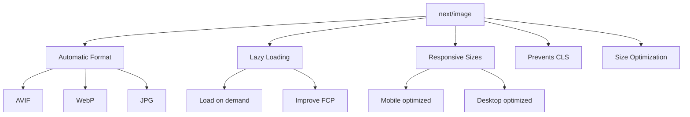
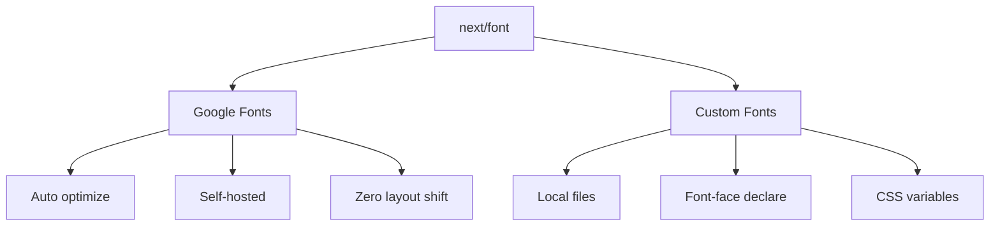

# Day 7: Images & Fonts Optimization

## 📚 Aaj Kya Seekhoge?
- next/image component use karna
- Image optimization features
- next/font se fonts load karna
- Google Fonts integrate karna
- Custom fonts add karna

---

## 🖼️ next/image Component

Next.js ka `next/image` component **automatic image optimization** karta hai.



### Benefits:
1. **Automatic Format** - AVIF, WebP automatically serve karta hai
2. **Lazy Loading** - Sirf tab load jab dikhe screen pe
3. **Responsive** - Har screen size pe sahi dikhta hai
4. **No CLS** - Layout shift nahi hota
5. **Optimized** - Size automatically optimize hota hai

---

## 📝 Basic Image Usage

```tsx
import Image from "next/image";

export default function Home() {
  return (
    <div>
      {/* Basic Image */}
      <Image
        src="/photo.jpg"
        alt="Description"
        width={500}
        height={300}
      />
      
      {/* Responsive Image with fill */}
      <div className="relative w-full h-64">
        <Image
          src="/photo.jpg"
          alt="Description"
          fill
          className="object-cover"
        />
      </div>
    </div>
  );
}
```

---

## 🎯 Image Properties

| Property | Type | Description |
|----------|------|-------------|
| `src` | string | Image path (local ya remote) |
| `alt` | string | Alternative text (accessibility) |
| `width` | number | Image width (pixels) |
| `height` | number | Image height (pixels) |
| `fill` | boolean | Responsive image (container fill) |
| `sizes` | string | Responsive breakpoints |
| `priority` | boolean | High priority (above fold) |
| `quality` | number | Image quality (1-100) |
| `placeholder` | string | Blur placeholder |

---

## 🖼️ Image Examples

### Example 1: Basic Image
```tsx
<Image
  src="/hero.jpg"
  alt="Hero image"
  width={800}
  height={400}
  className="rounded-lg"
/>
```

### Example 2: Responsive Image with Fill
```tsx
<div className="relative w-full h-64 md:h-96">
  <Image
    src="/hero.jpg"
    alt="Hero image"
    fill
    className="object-cover"
    sizes="(max-width: 768px) 100vw, 50vw"
  />
</div>
```

### Example 3: Image with Priority (Above the fold)
```tsx
<Image
  src="/logo.png"
  alt="Logo"
  width={200}
  height={50}
  priority
/>
```

### Example 4: Image with Quality
```tsx
<Image
  src="/photo.jpg"
  alt="High quality photo"
  width={1200}
  height={800}
  quality={100}
/>
```

---

## 🔤 next/font

`next/font` se tum **optimized fonts** load kar sakte ho jo self-hosted hote hain.



### Benefits:
1. **Self-hosted** - External CDN se load nahi hota
2. **Zero layout shift** - Font load hone pe shift nahi hota
3. **Fast** - Build time pe optimize hota hai
4. **CSS Variables** - Tailwind mein use kar sakte ho

---

## 📝 Google Fonts Use Karna

### Step 1: Import Font
```tsx
import { Inter, Roboto, Playfair_Display } from "next/font/google";

const inter = Inter({ subsets: ["latin"] });
const roboto = Roboto({ 
  weight: ["400", "700"],
  subsets: ["latin"] 
});
const playfair = Playfair_Display({ subsets: ["latin"] });
```

### Step 2: CSS Variable Assign Karna
```tsx
const inter = Inter({ 
  subsets: ["latin"],
  variable: "--font-inter",
});

const roboto = Roboto({ 
  weight: ["400", "700"],
  subsets: ["latin"],
  variable: "--font-roboto",
});
```

### Step 3: Layout mein Use Karna
```tsx
export default function RootLayout({ children }) {
  return (
    <html lang="en">
      <body className={`${inter.variable} ${roboto.variable}`}>
        {children}
      </body>
    </html>
  );
}
```

### Step 4: Tailwind mein Use Karna
```tsx
// Tailwind classes
<p className="font-sans">Inter font</p>
<p className="font-[family-name:var(--font-roboto)]">Roboto font</p>
```

---

## 📝 Complete Example

### app/layout.tsx:
```tsx
import type { Metadata } from "next";
import { Inter, Playfair_Display } from "next/font/google";
import "./globals.css";
import Navbar from "./components/Navbar";
import Footer from "./components/Footer";

const inter = Inter({ 
  subsets: ["latin"],
  variable: "--font-inter",
});

const playfair = Playfair_Display({ 
  subsets: ["latin"],
  variable: "--font-playfair",
});

export const metadata: Metadata = {
  title: "Images & Fonts Demo",
  description: "Learning next/image and next/font",
};

export default function RootLayout({
  children,
}: {
  children: React.ReactNode;
}) {
  return (
    <html lang="en">
      <body className={`${inter.variable} ${playfair.variable} font-sans`}>
        <div className="min-h-screen flex flex-col">
          <Navbar />
          <main className="flex-1">{children}</main>
          <Footer />
        </div>
      </body>
    </html>
  );
}
```

### app/page.tsx:
```tsx
import Image from "next/image";

export default function Home() {
  const products = [
    { id: 1, name: "Laptop", image: "/laptop.jpg", price: 999 },
    { id: 2, name: "Phone", image: "/phone.jpg", price: 699 },
    { id: 3, name: "Tablet", image: "/tablet.jpg", price: 499 },
  ];
  
  return (
    <div>
      {/* Hero Section with Image */}
      <div className="relative h-[500px]">
        <Image
          src="/hero.jpg"
          alt="Hero background"
          fill
          className="object-cover"
          priority
        />
        <div className="absolute inset-0 bg-black/50 flex items-center justify-center">
          <div className="text-center text-white">
            <h1 className="text-5xl font-bold mb-4 font-[family-name:var(--font-playfair)]">
              Welcome to Our Store
            </h1>
            <p className="text-xl mb-8 font-sans">
              Best products at best prices
            </p>
            <button className="bg-white text-black px-8 py-3 rounded-lg font-bold hover:bg-gray-100">
              Shop Now
            </button>
          </div>
        </div>
      </div>
      
      {/* Products Grid */}
      <div className="max-w-6xl mx-auto px-4 py-16">
        <h2 className="text-3xl font-bold mb-8 text-center">Our Products</h2>
        <div className="grid grid-cols-1 md:grid-cols-3 gap-8">
          {products.map((product) => (
            <div key={product.id} className="bg-white rounded-lg shadow-md overflow-hidden">
              <div className="relative h-48">
                <Image
                  src={product.image}
                  alt={product.name}
                  fill
                  className="object-cover"
                />
              </div>
              <div className="p-4">
                <h3 className="text-xl font-bold mb-2">{product.name}</h3>
                <p className="text-2xl text-green-600 font-bold">${product.price}</p>
              </div>
            </div>
          ))}
        </div>
      </div>
      
      {/* Font Showcase */}
      <div className="bg-gray-100 py-16">
        <div className="max-w-4xl mx-auto px-4">
          <h2 className="text-3xl font-bold mb-8 text-center">Font Showcase</h2>
          <div className="space-y-4">
            <p className="text-2xl font-[family-name:var(--font-playfair)]">
              Playfair Display - Elegant serif font
            </p>
            <p className="text-2xl font-sans">
              Inter - Clean sans-serif font
            </p>
            <p className="text-xl text-gray-600">
              Both fonts are self-hosted and optimized for performance.
            </p>
          </div>
        </div>
      </div>
    </div>
  );
}
```

---

## ⚠️ Common Mistakes

### Mistake 1: Width/Height na dena (without fill)
```tsx
// ❌ GALAT - Width/Height zaroori hai
<Image src="/photo.jpg" alt="Photo" />

// ✅ SAHI
<Image src="/photo.jpg" alt="Photo" width={500} height={300} />
```

### Mistake 2: fill use karte waqt container na dena
```tsx
// ❌ GALAT - Container nahi hai
<Image src="/photo.jpg" alt="Photo" fill />

// ✅ SAHI
<div className="relative w-full h-64">
  <Image src="/photo.jpg" alt="Photo" fill />
</div>
```

### Mistake 3: External images ke liye config na dena
```tsx
// next.config.ts mein add karo
const nextConfig = {
  images: {
    remotePatterns: [
      {
        protocol: "https",
        hostname: "example.com",
      },
    ],
  },
};
```

---

## 🎯 Aaj Ka Summary

| Component | Use Case |
|-----------|----------|
| `next/image` | Image optimization |
| `fill` | Responsive image in container |
| `priority` | Above the fold images |
| `next/font` | Optimized font loading |
| `variable` | CSS variable for Tailwind |

---

## ✅ Next Steps
- Kal hum **Flexbox & Grid** seekhenge
- Layouts banana seekhenge
- Aaj ke practice problems solve karo
