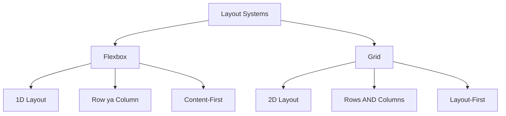
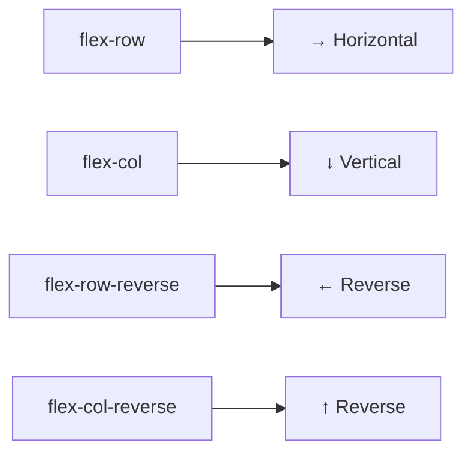
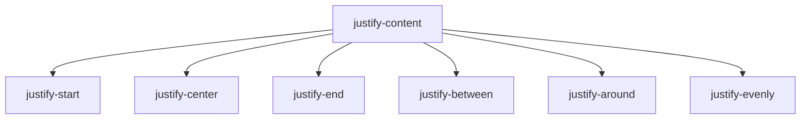
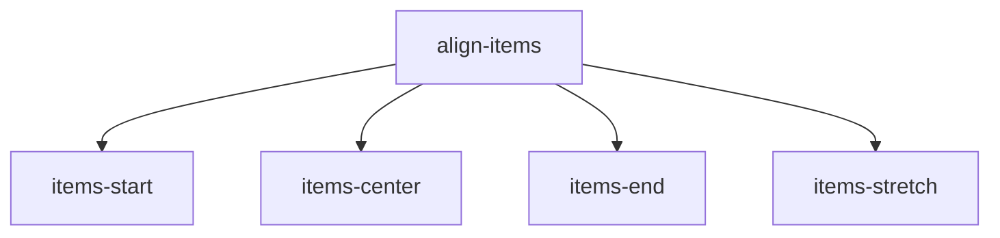
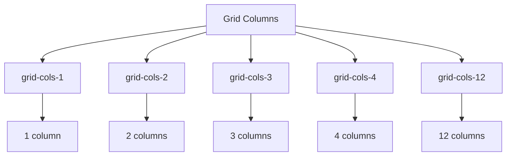

# Day 8: Flexbox & Grid in Tailwind

## 📚 Aaj Kya Seekhoge?
- Flexbox layout with Tailwind
- Grid layout with Tailwind
- Kab Flexbox aur kab Grid use karein
- Common layout patterns

---

## 🤔 Flexbox vs Grid



**Simple Rule:**
- **Flexbox** = Ek direction mein layout (row ya column)
- **Grid** = Dono directions mein layout (rows + columns)

---

## 📐 Flexbox with Tailwind

### Basic Flex Container:
```tsx
<div className="flex">
  <div>Item 1</div>
  <div>Item 2</div>
  <div>Item 3</div>
</div>
```

### Flex Direction:


```tsx
<div className="flex flex-row">Horizontal</div>
<div className="flex flex-col">Vertical</div>
```

### Justify Content (Main Axis):


```tsx
<div className="flex justify-center">Center</div>
<div className="flex justify-between">Space Between</div>
<div className="flex justify-end">End</div>
```

### Align Items (Cross Axis):


```tsx
<div className="flex items-center h-64">Center Vertically</div>
```

### Gap:
```tsx
<div className="flex gap-4">
  <div>1</div>
  <div>2</div>
  <div>3</div>
</div>
```

---

## 📊 Grid with Tailwind

### Basic Grid:
```tsx
<div className="grid grid-cols-3 gap-4">
  <div>1</div>
  <div>2</div>
  <div>3</div>
  <div>4</div>
  <div>5</div>
  <div>6</div>
</div>
```

### Grid Columns:


### Span Multiple Columns:
```tsx
<div className="grid grid-cols-3 gap-4">
  <div className="col-span-2">Spans 2</div>
  <div>1</div>
  <div>1</div>
  <div className="col-span-2">Spans 2</div>
</div>
```

---

## 🎯 Common Layout Patterns

### 1. Navbar Layout:
```tsx
<nav className="flex items-center justify-between p-4 bg-gray-800 text-white">
  <div className="text-xl font-bold">Logo</div>
  <div className="flex gap-4">
    <a href="#">Home</a>
    <a href="#">About</a>
  </div>
  <button className="bg-blue-500 px-4 py-2 rounded">Login</button>
</nav>
```

### 2. Card Grid:
```tsx
<div className="grid grid-cols-1 md:grid-cols-2 lg:grid-cols-3 gap-6">
  <div className="bg-white p-6 rounded shadow">Card 1</div>
  <div className="bg-white p-6 rounded shadow">Card 2</div>
  <div className="bg-white p-6 rounded shadow">Card 3</div>
</div>
```

### 3. Holy Grail Layout:
```tsx
<div className="min-h-screen flex flex-col">
  <header className="bg-gray-800 text-white p-4">Header</header>
  <div className="flex flex-1">
    <aside className="w-64 bg-gray-200 p-4">Sidebar</aside>
    <main className="flex-1 p-4">Content</main>
  </div>
  <footer className="bg-gray-800 text-white p-4">Footer</footer>
</div>
```

### 4. Centered Content:
```tsx
<div className="flex items-center justify-center min-h-screen">
  <div className="text-center">
    <h1 className="text-4xl font-bold">Centered!</h1>
  </div>
</div>
```

---

## 📝 Complete Example

```tsx
export default function Home() {
  return (
    <div className="min-h-screen bg-gray-100">
      {/* Flexbox Navbar */}
      <nav className="flex items-center justify-between bg-gray-800 text-white p-4">
        <div className="text-xl font-bold">MySite</div>
        <div className="flex gap-6">
          <a href="#" className="hover:text-gray-300">Home</a>
          <a href="#" className="hover:text-gray-300">About</a>
          <a href="#" className="hover:text-gray-300">Contact</a>
        </div>
        <button className="bg-blue-500 px-4 py-2 rounded">Login</button>
      </nav>
      
      {/* Grid Cards */}
      <div className="max-w-6xl mx-auto p-8">
        <h2 className="text-3xl font-bold mb-8 text-center">Features</h2>
        <div className="grid grid-cols-1 md:grid-cols-3 gap-6">
          <div className="bg-white p-6 rounded-lg shadow text-center">
            <div className="text-5xl mb-4">🚀</div>
            <h3 className="text-xl font-bold">Fast</h3>
            <p className="text-gray-600">Lightning fast</p>
          </div>
          <div className="bg-white p-6 rounded-lg shadow text-center">
            <div className="text-5xl mb-4">🔒</div>
            <h3 className="text-xl font-bold">Secure</h3>
            <p className="text-gray-600">Enterprise security</p>
          </div>
          <div className="bg-white p-6 rounded-lg shadow text-center">
            <div className="text-5xl mb-4">📱</div>
            <h3 className="text-xl font-bold">Responsive</h3>
            <p className="text-gray-600">All devices</p>
          </div>
        </div>
      </div>
      
      {/* Flex Centered */}
      <div className="flex items-center justify-center h-64 bg-blue-500 text-white">
        <div className="text-center">
          <h2 className="text-3xl font-bold mb-2">Centered Content</h2>
          <p>Using Flexbox</p>
        </div>
      </div>
    </div>
  );
}
```

---

## 🎯 Aaj Ka Summary

| Concept | Classes | Use Case |
|---------|---------|----------|
| Flex Row | `flex flex-row` | Horizontal layout |
| Flex Col | `flex flex-col` | Vertical layout |
| Justify | `justify-between` | Space between items |
| Align | `items-center` | Center vertically |
| Gap | `gap-4` | Space between items |
| Grid Cols | `grid-cols-3` | 3 column layout |
| Span | `col-span-2` | Element spans 2 cols |

---

## ✅ Next Steps
- Kal hum **Responsive Design** seekhenge
- Aaj ke practice problems solve karo
