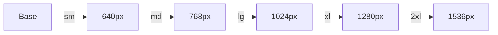
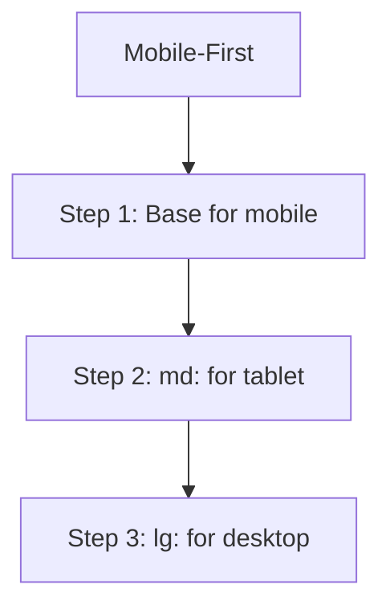

# Day 9: Responsive Design

## 📚 Aaj Kya Seekhoge?
- Tailwind breakpoints
- Mobile-first approach
- Responsive utilities
- Hide/Show patterns

---

## 📱 Tailwind Breakpoints



| Prefix | Min Width | Device |
|--------|-----------|--------|
| (base) | 0px | Mobile |
| `sm:` | 640px | Large Mobile |
| `md:` | 768px | Tablet |
| `lg:` | 1024px | Laptop |
| `xl:` | 1280px | Desktop |
| `2xl:` | 1536px | Large Desktop |

---

## 📱 Mobile-First Approach



**Rule:** Pehle mobile ke liye likho, phir bigger screens ke liye add karo.

---

## 📐 Responsive Examples

### Responsive Text:
```tsx
<h1 className="text-2xl md:text-3xl lg:text-5xl">
  Responsive Heading
</h1>
```

### Responsive Grid:
```tsx
<div className="grid grid-cols-1 md:grid-cols-2 lg:grid-cols-3 gap-4">
  <div>Card 1</div>
  <div>Card 2</div>
  <div>Card 3</div>
</div>
```

### Responsive Padding:
```tsx
<div className="p-4 md:p-8 lg:p-12">
  Responsive padding
</div>
```

### Hide/Show:
```tsx
<div className="hidden md:block">Desktop only</div>
<div className="block md:hidden">Mobile only</div>
```

---

## 📝 Complete Example

```tsx
export default function Home() {
  return (
    <div className="min-h-screen bg-gray-100">
      {/* Responsive Navbar */}
      <nav className="bg-gray-800 text-white p-4">
        <div className="max-w-6xl mx-auto flex justify-between items-center">
          <div className="text-xl font-bold">Logo</div>
          
          {/* Desktop Menu */}
          <div className="hidden md:flex gap-6">
            <a href="#" className="hover:text-gray-300">Home</a>
            <a href="#" className="hover:text-gray-300">About</a>
            <a href="#" className="hover:text-gray-300">Contact</a>
          </div>
          
          {/* Mobile Menu Button */}
          <button className="md:hidden">☰</button>
        </div>
      </nav>
      
      {/* Responsive Hero */}
      <div className="bg-gradient-to-r from-blue-500 to-purple-600 text-white py-16 md:py-24">
        <div className="max-w-6xl mx-auto px-4 text-center">
          <h1 className="text-3xl md:text-5xl lg:text-6xl font-bold mb-4">
            Responsive Hero
          </h1>
          <p className="text-lg md:text-xl mb-8">
            Mobile aur desktop dono pe sahi dikhta hai
          </p>
          <button className="bg-white text-blue-500 px-6 py-3 rounded font-bold">
            Get Started
          </button>
        </div>
      </div>
      
      {/* Responsive Cards */}
      <div className="max-w-6xl mx-auto px-4 py-16">
        <h2 className="text-2xl md:text-3xl font-bold mb-8 text-center">
          Our Services
        </h2>
        <div className="grid grid-cols-1 md:grid-cols-2 lg:grid-cols-3 gap-6">
          <div className="bg-white p-6 rounded-lg shadow">
            <div className="text-4xl mb-4">🚀</div>
            <h3 className="text-xl font-bold mb-2">Fast</h3>
            <p className="text-gray-600">Lightning fast performance</p>
          </div>
          <div className="bg-white p-6 rounded-lg shadow">
            <div className="text-4xl mb-4">🔒</div>
            <h3 className="text-xl font-bold mb-2">Secure</h3>
            <p className="text-gray-600">Enterprise security</p>
          </div>
          <div className="bg-white p-6 rounded-lg shadow">
            <div className="text-4xl mb-4">📱</div>
            <h3 className="text-xl font-bold mb-2">Responsive</h3>
            <p className="text-gray-600">All devices</p>
          </div>
        </div>
      </div>
    </div>
  );
}
```

---

## 🎯 Aaj Ka Summary

| Concept | Class | Use Case |
|---------|-------|----------|
| Mobile First | Base → md: → lg: | Progressive enhancement |
| Responsive Grid | `grid-cols-1 md:grid-cols-3` | Adaptive columns |
| Responsive Text | `text-xl md:text-3xl` | Size adapt |
| Hide/Show | `hidden md:block` | Device-specific |

---

## ✅ Next Steps
- Kal hum **Data Fetching** seekhenge
- Aaj ke practice problems solve karo
