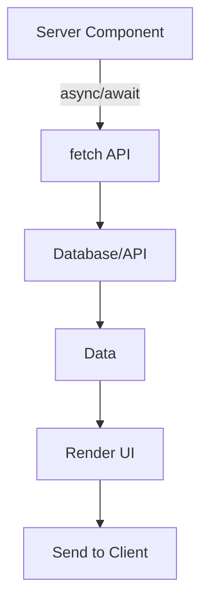

# Day 10: Data Fetching in Next.js

## 📚 Aaj Kya Seekhoge?
- Server Components mein data fetching
- Fetch API in async components
- Loading states
- Error handling

---

## 🔄 Data Fetching Patterns



---

## 📡 Basic Fetch in Server Component

```tsx
// app/posts/page.tsx
export default async function PostsPage() {
  const res = await fetch('https://jsonplaceholder.typicode.com/posts');
  const posts = await res.json();
  
  return (
    <div className="max-w-4xl mx-auto p-4">
      <h1 className="text-3xl font-bold mb-6">Posts</h1>
      <div className="space-y-4">
        {posts.slice(0, 10).map((post: any) => (
          <div key={post.id} className="bg-white p-6 rounded-lg shadow">
            <h2 className="text-xl font-bold">{post.title}</h2>
            <p className="text-gray-600 mt-2">{post.body}</p>
          </div>
        ))}
      </div>
    </div>
  );
}
```

---

## ⏳ Loading State with Suspense

```tsx
// app/posts/loading.tsx
export default function Loading() {
  return (
    <div className="max-w-4xl mx-auto p-4">
      <div className="animate-pulse space-y-4">
        {[1, 2, 3].map((i) => (
          <div key={i} className="bg-gray-200 h-32 rounded-lg"></div>
        ))}
      </div>
    </div>
  );
}
```

---

## ❌ Error Handling

```tsx
// app/posts/error.tsx
"use client";

export default function Error({
  error,
  reset,
}: {
  error: Error & { digest?: string };
  reset: () => void;
}) {
  return (
    <div className="max-w-4xl mx-auto p-4 text-center">
      <h2 className="text-2xl font-bold text-red-600 mb-4">Something went wrong!</h2>
      <p className="text-gray-600 mb-4">{error.message}</p>
      <button 
        onClick={reset}
        className="bg-blue-500 text-white px-4 py-2 rounded"
      >
        Try again
      </button>
    </div>
  );
}
```

---

## 🔄 Fetch with Options

```tsx
// Revalidation options
const res = await fetch('https://api.example.com/data', {
  next: { revalidate: 3600 } // Revalidate every hour
});

// OR use cache: 'no-store' for always fresh
const res = await fetch('https://api.example.com/data', {
  cache: 'no-store'
});
```

---

## 📝 Complete Example with Loading & Error

```tsx
// app/users/page.tsx
import { Suspense } from 'react';

async function UserList() {
  const res = await fetch('https://jsonplaceholder.typicode.com/users');
  const users = await res.json();
  
  return (
    <div className="grid grid-cols-1 md:grid-cols-3 gap-4">
      {users.map((user: any) => (
        <div key={user.id} className="bg-white p-6 rounded-lg shadow">
          <h3 className="text-xl font-bold">{user.name}</h3>
          <p className="text-gray-600">{user.email}</p>
          <p className="text-gray-500">{user.phone}</p>
        </div>
      ))}
    </div>
  );
}

export default function UsersPage() {
  return (
    <div className="max-w-6xl mx-auto p-4">
      <h1 className="text-3xl font-bold mb-6">Users</h1>
      <Suspense fallback={
        <div className="grid grid-cols-1 md:grid-cols-3 gap-4">
          {[1, 2, 3].map((i) => (
            <div key={i} className="bg-gray-200 h-32 rounded-lg animate-pulse"></div>
          ))}
        </div>
      }>
        <UserList />
      </Suspense>
    </div>
  );
}
```

---

## 🎯 Aaj Ka Summary

| Concept | Code | Use Case |
|---------|------|----------|
| Basic Fetch | `await fetch(url)` | Data load |
| Loading | `loading.tsx` | Suspense fallback |
| Error | `error.tsx` | Error boundary |
| Revalidate | `revalidate: 3600` | ISR |

---

## ✅ Next Steps
- Kal hum **Special Files (page, layout, loading, error)** detail mein seekhenge
- Aaj ke practice problems solve karo
