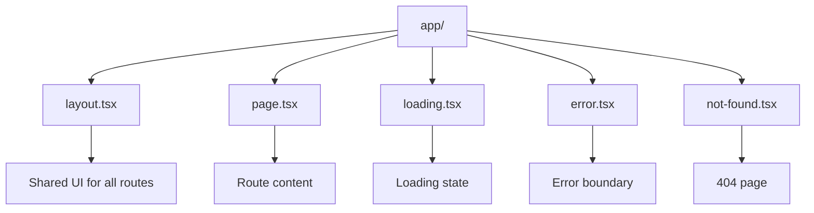

# Day 11: Special Files (page, layout, loading, error, not-found)

## 📚 Aaj Kya Seekhoge?
- Next.js special files
- page.tsx - Route content
- layout.tsx - Shared UI
- loading.tsx - Loading UI
- error.tsx - Error boundary
- not-found.tsx - 404 page

---

## 📁 Special Files Overview



---

## 📄 page.tsx (Required)

```tsx
// app/page.tsx - Home page
export default function HomePage() {
  return (
    <div>
      <h1>Welcome to My Site</h1>
    </div>
  );
}

// app/about/page.tsx - About page
export default function AboutPage() {
  return (
    <div>
      <h1>About Us</h1>
    </div>
  );
}
```

---

## 📐 layout.tsx (Wrapper)

```tsx
// app/layout.tsx
import type { Metadata } from 'next';

export const metadata: Metadata = {
  title: 'My Site',
  description: 'A Next.js website',
};

export default function RootLayout({
  children,
}: {
  children: React.ReactNode;
}) {
  return (
    <html lang="en">
      <body>
        <nav>Navigation</nav>
        <main>{children}</main>
        <footer>Footer</footer>
      </body>
    </html>
  );
}
```

---

## ⏳ loading.tsx (Auto-wraps page)

```tsx
// app/dashboard/loading.tsx
export default function DashboardLoading() {
  return (
    <div className="animate-pulse">
      <div className="h-8 bg-gray-200 rounded w-1/4 mb-4"></div>
      <div className="h-64 bg-gray-200 rounded"></div>
    </div>
  );
}
```

---

## ❌ error.tsx (Must be Client Component)

```tsx
// app/dashboard/error.tsx
"use client";

export default function DashboardError({
  error,
  reset,
}: {
  error: Error & { digest?: string };
  reset: () => void;
}) {
  return (
    <div className="text-center py-10">
      <h2 className="text-2xl font-bold text-red-600 mb-4">
        Something went wrong!
      </h2>
      <button 
        onClick={reset}
        className="bg-blue-500 text-white px-4 py-2 rounded"
      >
        Try again
      </button>
    </div>
  );
}
```

---

## 🔍 not-found.tsx (404 Page)

```tsx
// app/not-found.tsx
import Link from 'next/link';

export default function NotFound() {
  return (
    <div className="text-center py-20">
      <h1 className="text-6xl font-bold mb-4">404</h1>
      <h2 className="text-2xl mb-8">Page Not Found</h2>
      <Link 
        href="/"
        className="bg-blue-500 text-white px-6 py-3 rounded"
      >
        Go Home
      </Link>
    </div>
  );
}

// Programmatic 404
import { notFound } from 'next/navigation';

async function getUser(id: string) {
  const res = await fetch(`https://api.example.com/users/${id}`);
  if (!res.ok) notFound();
  return res.json();
}
```

---

## 📝 Complete Example with All Special Files

```tsx
// app/layout.tsx
import type { Metadata } from 'next';

export const metadata: Metadata = {
  title: 'My App',
  description: 'Full example with all special files',
};

export default function RootLayout({
  children,
}: {
  children: React.ReactNode;
}) {
  return (
    <html lang="en">
      <body className="bg-gray-50 min-h-screen">
        <nav className="bg-white shadow">
          <div className="max-w-6xl mx-auto p-4 flex justify-between">
            <a href="/" className="font-bold text-xl">MyApp</a>
            <div className="flex gap-4">
              <a href="/" className="hover:text-blue-500">Home</a>
              <a href="/about" className="hover:text-blue-500">About</a>
              <a href="/dashboard" className="hover:text-blue-500">Dashboard</a>
            </div>
          </div>
        </nav>
        <main>{children}</main>
        <footer className="bg-gray-800 text-white text-center p-4">
          <p>&copy; 2026 MyApp</p>
        </footer>
      </body>
    </html>
  );
}

// app/page.tsx
export default function HomePage() {
  return (
    <div className="max-w-6xl mx-auto p-4">
      <h1 className="text-4xl font-bold">Home Page</h1>
    </div>
  );
}

// app/dashboard/loading.tsx
export default function Loading() {
  return (
    <div className="max-w-6xl mx-auto p-4">
      <div className="animate-pulse space-y-4">
        <div className="h-8 bg-gray-200 rounded w-1/4"></div>
        <div className="h-64 bg-gray-200 rounded"></div>
      </div>
    </div>
  );
}

// app/dashboard/error.tsx
"use client";
export default function Error({ error, reset }: { error: Error; reset: () => void }) {
  return (
    <div className="text-center py-10">
      <h2 className="text-2xl font-bold text-red-600">Error!</h2>
      <button onClick={reset} className="mt-4 bg-blue-500 text-white px-4 py-2 rounded">
        Try again
      </button>
    </div>
  );
}

// app/not-found.tsx
import Link from 'next/link';
export default function NotFound() {
  return (
    <div className="text-center py-20">
      <h1 className="text-6xl font-bold">404</h1>
      <Link href="/" className="inline-block mt-4 bg-blue-500 text-white px-6 py-3 rounded">
        Go Home
      </Link>
    </div>
  );
}
```

---

## 🎯 Aaj Ka Summary

| File | Purpose | Type |
|------|---------|------|
| `page.tsx` | Route content | Required |
| `layout.tsx` | Shared UI wrapper | Optional |
| `loading.tsx` | Loading state | Optional |
| `error.tsx` | Error boundary | Client Component |
| `not-found.tsx` | 404 page | Optional |

---

## ✅ Next Steps
- Kal hum **Metadata & SEO** seekhenge
- Aaj ke practice problems solve karo
